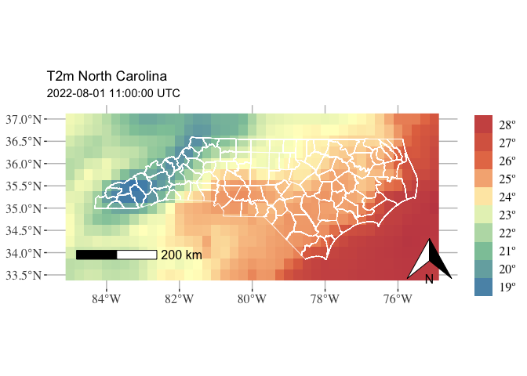

era5-reanalysis-processing
================
2023-07-24

Libraries

``` r
# -- for spatial data
#library(raster)   # -- old
#library(rgdal)    # -- deprecated in 10/2023
#library(rgeos)    # -- deprecated in 10/2023
#library(maptools) # -- deprecated in 10/2023
options("sp_evolution_status" = 2) # use sf instead of rgdal and rgeos in sp
library(sp)
library(terra)
library(sf)
library(ncdf4)

# -- for timeseries
library(lubridate)
library(zoo)
library(xts)

# -- 
library(ggplot2)
library(ggspatial)
library(tidyterra)
library(maditr)
library(tidyverse)
library(viridis)
```

#### NC shapefile

``` r
nc.borders <- vect("../input/NC_county_boundary/North_Carolina_State_and_County_Boundary_Polygons.shp")
```

#### Temperature ERA5 reanalysis

Open netcdf data with all JJA hourly ERA5 reanalysis

``` r
t2m.rea <- nc_open("../input/era5_hourly_reanalysis_20220601_20220831.nc")
print(t2m.rea)
```

    ## File ../input/era5_hourly_reanalysis_20220601_20220831.nc (NC_FORMAT_64BIT):
    ## 
    ##      1 variables (excluding dimension variables):
    ##         short t2m[longitude,latitude,time]   
    ##             scale_factor: 0.000480174647219721
    ##             add_offset: 297.344486475176
    ##             _FillValue: -32767
    ##             missing_value: -32767
    ##             units: K
    ##             long_name: 2 metre temperature
    ## 
    ##      3 dimensions:
    ##         longitude  Size:41 
    ##             units: degrees_east
    ##             long_name: longitude
    ##         latitude  Size:15 
    ##             units: degrees_north
    ##             long_name: latitude
    ##         time  Size:2208 
    ##             units: hours since 1900-01-01 00:00:00.0
    ##             long_name: time
    ##             calendar: gregorian
    ## 
    ##     2 global attributes:
    ##         Conventions: CF-1.6
    ##         history: 2023-07-24 20:09:56 GMT by grib_to_netcdf-2.25.1: /opt/ecmwf/mars-client/bin/grib_to_netcdf.bin -S param -o /cache/data1/adaptor.mars.internal-1690229391.5737147-17528-3-cb79dd1f-4d40-4f85-b17b-6992eadff943.nc /cache/tmp/cb79dd1f-4d40-4f85-b17b-6992eadff943-adaptor.mars.internal-1690229343.5283673-17528-4-tmp.grib

Extract data in vectors and 3d-matrix

``` r
lon <- ncvar_get(t2m.rea, "longitude")
lat <- ncvar_get(t2m.rea, "latitude")
time <- ncvar_get(t2m.rea, "time")
t2m <- ncvar_get(t2m.rea, "t2m") - 273.15
na.value <- ncatt_get(t2m.rea, "t2m", "_FillValue")$value
t2m[t2m==na.value] <- NA
cat(paste('time units:', ncatt_get(t2m.rea, "time", "units")$value))
```

    ## time units: hours since 1900-01-01 00:00:00.0

``` r
time <- as.POSIXct(time*3600, origin="1900-01-01", tz="UTC")
```

Map T2M for one hour

``` r
# one time
ts <- as.POSIXct("2022-08-01 11:00:00 UTC", tz='UTC')
samp <- t2m[,,which(time==ts)]
# need to add 0.25/2 to 
samp.rast <- rast(t(samp), extent=c(-85.125,-74.875,33.375,37.125), crs='+proj=longlat +datum=WGS84 +no_defs +ellps=WGS84 +towgs84=0,0,0')

ggplot() +
  geom_spatraster(data = samp.rast) +
  geom_sf(data = st_as_sf(nc.borders), aes(geometry=geometry), 
               colour = "white", linewidth=.3, fill = NA) +
  scale_fill_whitebox_c(
    palette = "muted",
    labels = scales::label_number(suffix = "º"),
    n.breaks = 12,
    guide = guide_legend(reverse = TRUE)
  ) +
  labs(
    fill = "",
    title = "T2m North Carolina",
    subtitle = paste(ts, 'UTC')
  ) +
  annotation_scale(
    location="bl", pad_x = unit(1, "cm"), 
        pad_y = unit(1, "cm"), 
        height = unit(0.30, "cm"), 
        text_cex = 1
    ) +
    annotation_north_arrow(
      location = "br", 
      which_north = "true", 
        pad_x = unit(0.2, "cm"), 
        pad_y = unit(0.2, "cm")
    ) +
    theme(
            axis.text = element_text(size=12, family="serif"),
            plot.caption = element_text(size=10, family="serif"),
            legend.text = element_text(size=12, family="serif"),
            legend.title = element_text(size=12, family="serif"),
            panel.background = element_rect(fill = "white"),
            panel.grid.major=element_line(colour="grey")
        )
```

<!-- -->

Code to create a dataframe from the netcdf

``` r
# -- /!\ latitude vector is decreasing
lon.lat.time <- as.matrix(expand.grid(lon, rev(lat), time))
t2m.vect <- as.vector(t2m[,ncol(t2m):1,])
t2m.df <- data.frame(cbind(lon.lat.time, t2m.vect))
colnames(t2m.df) <- c("lon", "lat", "time", 't2m')
t2m.df$t2m <- as.numeric(t2m)
```

Session info

``` r
sessionInfo()
```

    ## R version 4.3.1 (2023-06-16)
    ## Platform: aarch64-apple-darwin20 (64-bit)
    ## Running under: macOS Ventura 13.4.1
    ## 
    ## Matrix products: default
    ## BLAS:   /Library/Frameworks/R.framework/Versions/4.3-arm64/Resources/lib/libRblas.0.dylib 
    ## LAPACK: /Library/Frameworks/R.framework/Versions/4.3-arm64/Resources/lib/libRlapack.dylib;  LAPACK version 3.11.0
    ## 
    ## locale:
    ## [1] en_US.UTF-8/en_US.UTF-8/en_US.UTF-8/C/en_US.UTF-8/en_US.UTF-8
    ## 
    ## time zone: America/New_York
    ## tzcode source: internal
    ## 
    ## attached base packages:
    ## [1] stats     graphics  grDevices utils     datasets  methods   base     
    ## 
    ## other attached packages:
    ##  [1] viridis_0.6.3     viridisLite_0.4.2 forcats_1.0.0     stringr_1.5.0    
    ##  [5] dplyr_1.1.2       purrr_1.0.1       readr_2.1.4       tidyr_1.3.0      
    ##  [9] tibble_3.2.1      tidyverse_2.0.0   maditr_0.8.3      tidyterra_0.4.0  
    ## [13] ggspatial_1.1.8   ggplot2_3.4.2     xts_0.13.1        zoo_1.8-12       
    ## [17] lubridate_1.9.2   ncdf4_1.21        sf_1.0-14         terra_1.7-39     
    ## [21] sp_2.0-0         
    ## 
    ## loaded via a namespace (and not attached):
    ##  [1] utf8_1.2.3         generics_0.1.3     class_7.3-22       KernSmooth_2.23-21
    ##  [5] stringi_1.7.12     lattice_0.21-8     hms_1.1.3          digest_0.6.33     
    ##  [9] magrittr_2.0.3     evaluate_0.21      grid_4.3.1         timechange_0.2.0  
    ## [13] fastmap_1.1.1      e1071_1.7-13       DBI_1.1.3          gridExtra_2.3     
    ## [17] fansi_1.0.4        scales_1.2.1       codetools_0.2-19   cli_3.6.1         
    ## [21] rlang_1.1.1        units_0.8-2        munsell_0.5.0      withr_2.5.0       
    ## [25] yaml_2.3.7         tools_4.3.1        tzdb_0.4.0         colorspace_2.1-0  
    ## [29] vctrs_0.6.3        R6_2.5.1           proxy_0.4-27       lifecycle_1.0.3   
    ## [33] classInt_0.4-9     pkgconfig_2.0.3    pillar_1.9.0       gtable_0.3.3      
    ## [37] data.table_1.14.8  glue_1.6.2         Rcpp_1.0.11        highr_0.10        
    ## [41] xfun_0.39          tidyselect_1.2.0   rstudioapi_0.15.0  knitr_1.43        
    ## [45] farver_2.1.1       htmltools_0.5.5    labeling_0.4.2     rmarkdown_2.23    
    ## [49] compiler_4.3.1
